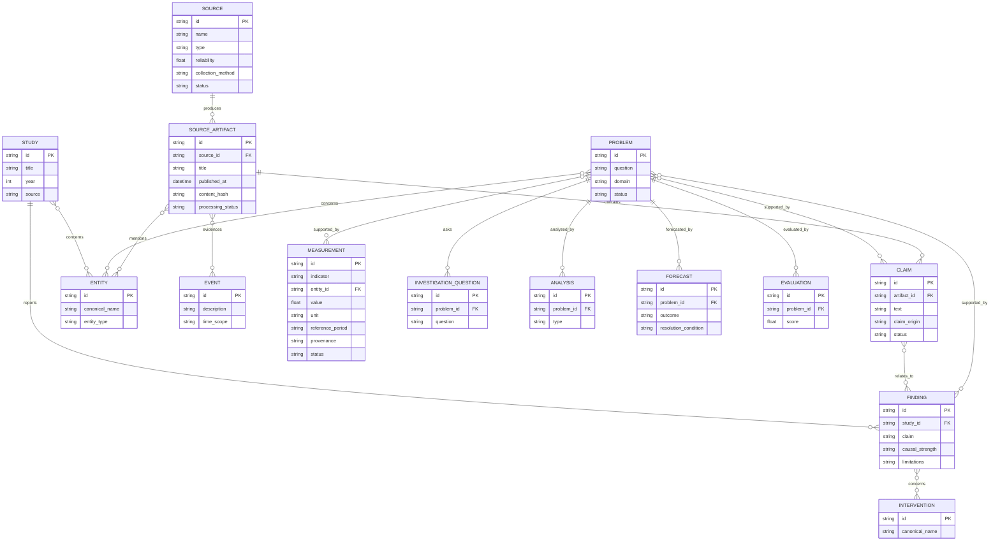
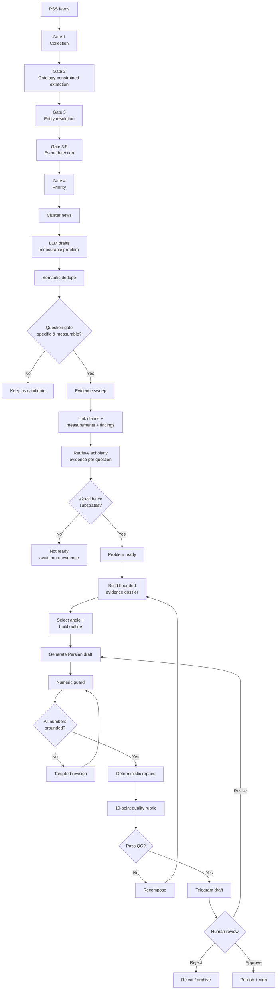

# Design — Ontology, Gates, and Pipeline Architecture

This document explains what NePsus computes and why. It is the map of the
repository.

## 1. The idea 

News tells you *that* something happens. Data tells you *how much*. Research
tells you *why*. NePsus is a pipeline that fuses all three: it ingests news
feeds, distills them into measurable research problems, attaches evidence
from official statistics and scholarly literature, and only then lets an LLM
write an analytical post where every number in the draft is mechanically
verified against the gathered evidence before publication. Quality gates and
a human reviewer sit between composition and the channel.

## 2. The ontology (objects in the database)

The system is ontology-first: the object types and their relations were
designed before the code, and every extractor is constrained to produce them.

| Object | Table | What it is | Where it comes from |
|---|---|---|---|
| **Source** | `sources` | A feed or data provider (RSS, World Bank, IMF, …) | `sources.yaml` |
| **SourceArtifact** | `source_artifacts` | One fetched article/document, with title, text, processing status | Gate 1 |
| **Claim** | `claims` | A falsifiable proposition extracted from an artifact ("X stated Y about Z") | Gate 2 LLM extraction |
| **Measurement** | `measurements` | A numeric observation: indicator, value, unit, reference period, provenance | World Bank/IMF/OWID adapters |
| **Event** | `events` | A bounded happening with time and actors (strike, launch, ruling) | Gate 3.5 |
| **Study** | `studies` | A scholarly paper retrieved for a question (OpenAlex) | Investigation layer |
| **Finding** | `findings` | A causal or associational claim extracted from a study, with graded `causal_strength` and `limitations` | Investigation layer |
| **Intervention** | `interventions` | A named action/program upserted by canonical name — many studies attach to one intervention | Investigation layer |
| **Problem** | `problems` | One measurable research question (the unit of editorial work) | Discovery layer |
| **InvestigationQuestion** | `investigation_questions` | 3 specific Persian sub-questions per problem | Discovery layer |
| **Analysis / Forecast / Evaluation** | `analyses`, `forecasts`, `evaluations` | Synthesis objects: scenario analysis, verifiable forecasts with adjudication criteria, later scoring | Forecast lane |

Relations are explicit join tables: `problem_evidence` (problem → claim /
measurement / finding), `evidence_relation` (claim ↔ finding, the
news-versus-research link), `finding_interventions`, `artifact_entities`,
`problem_entities`. The entity tables give every actor a stable id so the
same actor can be joined across artifacts, problems, and studies.

Key status machines:

- `problems.status`: `candidate → ready → published`, with `archived` for
  human-rejected problems (rejection removes the problem from every queue;
  it can be restored).
- `claims.status`: `candidate → accepted / contested / rejected`.
- `source_artifacts.processing_status`: `pending → extracted`, with
  `rejected` / `archived` for junk.


## 3. The gates (discovery front-end)

The discovery layer turns firehose into a short list of research-ready
problems. Each gate is a separate module with a mechanical, inspectable
rule.

```
RSS feeds ─► Gate 1 ─► Gate 2 ─► cluster ─► LLM draft ─► dedupe ─► question gate ─► evidence sweep ─► ready
```

1. **Gate 1 — Collection** (`src/gate1_collection.py`). Fetch feeds, dedupe
   by content hash, store artifacts. No LLM.
2. **Gate 2 — Extraction** (`src/gate2_extraction.py`). Ontology-constrained
   LLM extraction of claims/events/entities from each new artifact. JSON
   schema repair pass when the model misbehaves.
3. **Gate 3 — Resolution** (`src/gate3_resolution.py`). Entity resolution so
   "the central bank" and "CBI" resolve to one entity.
4. **Gate 3.5 — Event detection** (`src/gate3_5_events.py`). Decide whether
   an artifact is a bounded event worth an Event row. Conservative: on any
   failure the artifact stays eligible (never silently drop).
5. **Gate 4 — Priority** (`src/gate4_priority.py`). Mechanical ranking of
   pending work.
6. **Discovery** (`eval/discover.py`). Cluster titles by shared content
   words; draft ONE measurable problem per cluster (LLM prompt forbids
   "and"-bundles and unmeasurable questions); semantic dedupe against every
   existing problem; a Persian question gate (specific actors/mechanisms or
   the problem is stored as `candidate`, never silently ready).
7. **Evidence sweep** (`eval/intake.py`, `eval/link_findings.py`,
   `src/investigation_layer/pipeline.py`). Link claims + series + findings;
   retrieve scholarly papers per question from OpenAlex. A problem becomes
   `ready` only with **≥2 evidence substrates** — the anti-fabrication rule
   that keeps the composer honest.

Domain diversity is codified in discovery: each problem is classified
(conflict / economy / tech / science / environment / society), scarcest
domains are drafted first, and at most one problem per domain is drafted per
run so the dominant political story cannot fill the queue (see
`tests/test_discovery_diversity.py`).

**Pipeline Lifecycle**



## 4. Composition (dossier → verified post)

`eval/run_v03.py` drives the per-problem loop:

1. **Dossier** (`src/investigation_layer/dossier.py`): every piece of linked
   evidence (claims with sources, measurements with values/periods/provenance,
   findings with causal strength) is compiled into a single bounded text —
   the *only* thing the writer LLM sees. Numbers may not be invented; they
   come from the dossier.
2. **Outline + draft** (`writer.py`): angle selection, hook rotation against
   recent openings, then the Persian draft.
3. **Numeric guard** (`reviewer.py`): extract every number from the draft and
   check it against the dossier. Wrong/absent numbers are fabrication →
   targeted revision.
4. **Deterministic repair** (`fa_norm.py`): instead of re-prompting, tested
   functions fix known LLM failure modes — splitting run-on sentences at
   safe joints, inserting `[منبع: …]` attributions beside numbers, rounding
   absurd precision, correcting mislabeled sources, removing weasel
   attributions. Each repair is observable in logs.
5. **Review + rubric** (`reviewer.py`): the draft is scored 0–10
   (honesty, thesis, scenario logic, Persian quality, attribution, hook).
   QC failures trigger one recomposition; the best passing attempt ships.
6. **Card / concept image** (`eval/cards.py`, `eval/concept.py`): a data card
   from the verified numbers, or a text-free concept image when no hero
   number exists.

## 5. Delivery (human-in-the-loop)

`eval/nexus_bot.py` (Telegram) and `panel/` (local web) are two windows on
the same state:

- The bot sends the draft + card to the admin chat with **approve / sign**
  buttons. Approval publishes to the channel and signs it — nothing reaches
  readers without a human tap.
- The panel (stdlib `http.server`, no framework) shows the funnel, problem
  triage (reject → archive → restore), the post queue, rubric scores, and
  per-task LLM assignment with live route health. Panel→bot handoff is a
  file handshake (`var/panel_drafts.json`) the bot polls.

## 6. LLM routing and resilience

Free-tier providers fail constantly: 429 quota walls, 502/503s, dead models.
`src/route_health.py` is the answer:

- Every LLM call declares a **task** (`extract`, `draft`, `compose`,
  `cards`, …). Tasks map to **combos** (named groups of provider-model
  routes, e.g. `Mechanical`, `Complicated`) in
  `src/investigation_layer/models.py`.
- Calls walk candidates **health-first**: a shared ledger
  (`var/route_health.json`, written by panel and pipeline alike) quarantines
  a route after repeated failures and demotes it in every later walk.
- A bounded retry budget (`ROUTER_MAX_ATTEMPTS`) prevents the
  retry-forever pathology; a whole-combo fallback order keeps the pipeline
  alive when one provider dies.


