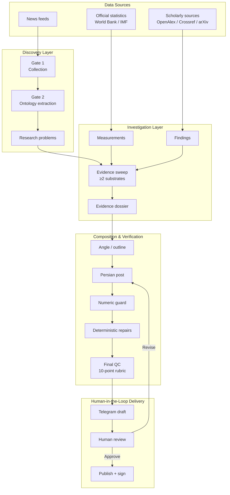

# NePsus V0.3 — Evidence-Grounded Agentic Content Pipeline

An agentic LLM system that runs a personal data-journalism desk end-to-end:
it monitors news feeds, discovers measurable research problems, gathers
evidence (claims, official statistics, scholarly papers), composes
publish-ready analytical posts in Persian, enforces verification and quality
gates, and publishes through a human-in-the-loop Telegram review flow.

Built as a research-engineering vehicle for studying what it actually takes
to make LLM agents reliable: evidence grounding, ontology-first extraction,
deterministic post-processing over model retries, and systematic quality
scoring of generated output.

NePsus is a primitive version that will eventually develop into [Nexus](https://github.com/Mosavih/Nexus-Think-Tank).

**Read [DESIGN.md](DESIGN.md) first** — it explains the ontology (the
database objects), the gate pipeline, and how composition/verification work.

## Architecture



- **Discovery layer** — RSS ingestion, semantic clustering, LLM problem
  drafting constrained to *measurable* statements, semantic dedup, and an
  evidence gate (a problem needs ≥2 evidence substrates before it is ready).
- **Investigation layer** — an ontology-first pipeline: predefined object
  types (claims, findings, measurements, events) extracted from articles and
  papers, linked to problems, and assembled into an evidence dossier.
- **Composition layer** — dossier → angle selection → Persian post with
  verified numbers: every claim in a post is checked against the dossier
  (numeric guard), normed deterministically (rounding, source attribution,
  run-on splitting), and scored on a 10-point rubric before delivery.
- **Delivery layer** — Telegram bot with progress bars, kill switches,
  approve/sign buttons; a local read-first web panel for monitoring the
  whole funnel, LLM route health, and post management.
- **Resilience layer** — multi-provider LLM routing with health ledger,
  quarantine, and combo-based task assignment; free-tier providers fail
  often, so calls walk healthy routes first and record every outcome.

## Highlights

- **Verification over generation**: posts are graded (honesty, thesis,
  attribution, …) and only high scorers ship; failed checks trigger targeted
  regeneration or deterministic repair.
- **Deterministic cures for LLM failure modes**: run-on splitting, source
  insertion, number rounding, misattribution correction — each a tested,
  auditable function instead of a prompt tweak.
- **Panel control room** (stdlib-only web UI): funnel monitoring, problem
  triage (reject/archive/restore), post queue with bot handoff, per-task LLM
  combo assignment with live health/quarantine.
- **Human-in-the-loop publishing**: nothing reaches the channel without
  approval; the bot sends drafts with approve/sign buttons and tracks
  delivery state.

## Layout

```
src/                core pipeline (gates, ontology, composition, review)
  gate1..gate4      news collection → extraction → resolution → priority
  investigation_layer/
                    dossier, composer, reviewer, fa_norm (deterministic
                    Persian repairs), retrieval, models (task→combo map)
  route_health.py   multi-provider LLM routing + shared health ledger
panel/              local control-room web UI (read-first, POST+confirm)
eval/               runners: discovery, compose loop, bot, delivery
tests/              pipeline tests (discovery diversity, evidence, gates)
examples/           three published posts (text + card/concept image)
```

See [CONFIG.md](CONFIG.md) for environment variables and how to run the
pipeline, bot, and panel.

## Status

**V0.3 — functional research-engineering prototype**

The end-to-end pipeline is operational on a fixed evaluation corpus, including
discovery, evidence retrieval, ontology-based investigation, composition,
numeric verification, quality gating, and human-reviewed Telegram delivery.

Research preview. The system runs daily on a live Telegram channel; the
public release is a cleaned snapshot of the production tree.

## License

MIT
